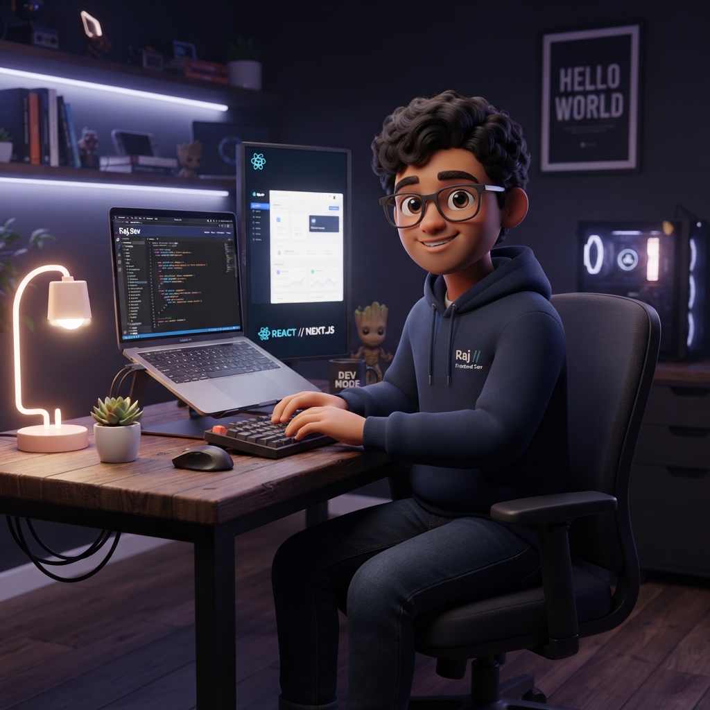

  
  
  <h1>✨ Raj Suhandani's Portfolio ✨</h1>
  
<strong>A modern, responsive, and visually engaging personal portfolio showcasing my journey as a Front-End Developer.</strong>

  

    <a href="#about">About</a> •
    <a href="#features">Features</a> •
    <a href="#skills">Skills</a> •
    <a href="#projects">Projects</a> •
    <a href="#contact">Contact</a>
  

---

## 🌟 About This Project

This portfolio is a digital representation of my skills and passion for web development. Designed with a clean, gamer-inspired aesthetic, it highlights my dedication to building pixel-perfect, responsive, and user-friendly web experiences. 

> *"Code should be as clean as a speedrun and UI should be as engaging as a boss battle."* 🎮

## ✨ Features

- **Modern UI/UX:** Clean, intuitive, and visually appealing design.
- **Fully Responsive:** Looks great on desktops, tablets, and mobile devices.
- **Interactive Elements:** Smooth hover states, micro-interactions, and transitions.
- **Project Showcase:** Beautifully presented cards highlighting my best work.
- **Contact Form:** A sleek form for easy communication.

## 🛠️ Skills Highlighted

The portfolio demonstrates proficiency in core web technologies:

- **HTML5:** Semantic structure and accessibility.
- **CSS3:** Modern styling, Sass, Tailwind, animations, Flexbox, and Grid layouts.
- **JavaScript:** Dynamic interactivity and functionality.

## 📁 Featured Projects

This portfolio includes a selection of my specialized work:
1. **Product Card:** A sleek, interactive product card with hover states.
2. **Login & SignUp Forms:** Modern glassmorphism designs with smooth transitions.
3. **Landing Page:** A high-conversion landing page with custom illustrations.

## 🚀 Getting Started

To view the portfolio locally:

1. Clone this repository to your local machine.
2. Open the `Portfolio` folder.
3. Simply open `index.html` in your favorite web browser! No complex setup required.

---

  
Built with ❤️ by Raj Suhandani

  
Let's build something amazing together!

