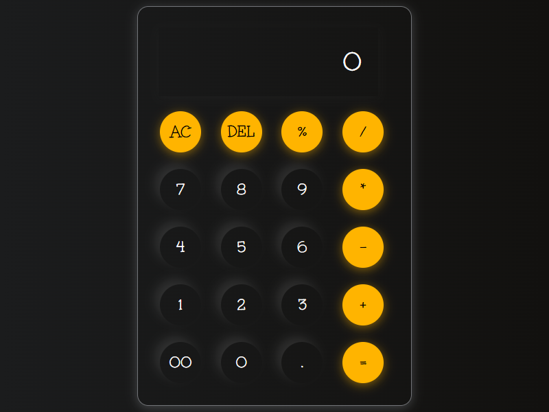

# 🧮 Cute Calculator 💖

Welcome to this adorable, fully functional web calculator! ✨ I've crafted this little app with love, HTML, CSS, and JavaScript. 

## 🎀 What's Inside?
Here is everything that has been made in this cute project:
- **`index.html`**: The skeleton and structure of our calculator.
- **`style.css`**: All the gorgeous styling! We used a beautiful gradient background, a sleek transparent look for the calculator body, and popping yellow buttons (`#ffb400`) with lovely shadow effects for that premium feel! 🌟
- **`script.js`**: The brains of the operation! Handling all the math magic and user interactions.

## 📸 Live Preview
Check out how pretty it looks!

## 🚀 How to use
Just open `index.html` in your favorite browser and start calculating! It supports basic operations like addition, subtraction, multiplication, division, percentages, and even a lovely `DEL` and `AC` button.

Made with 💕!
